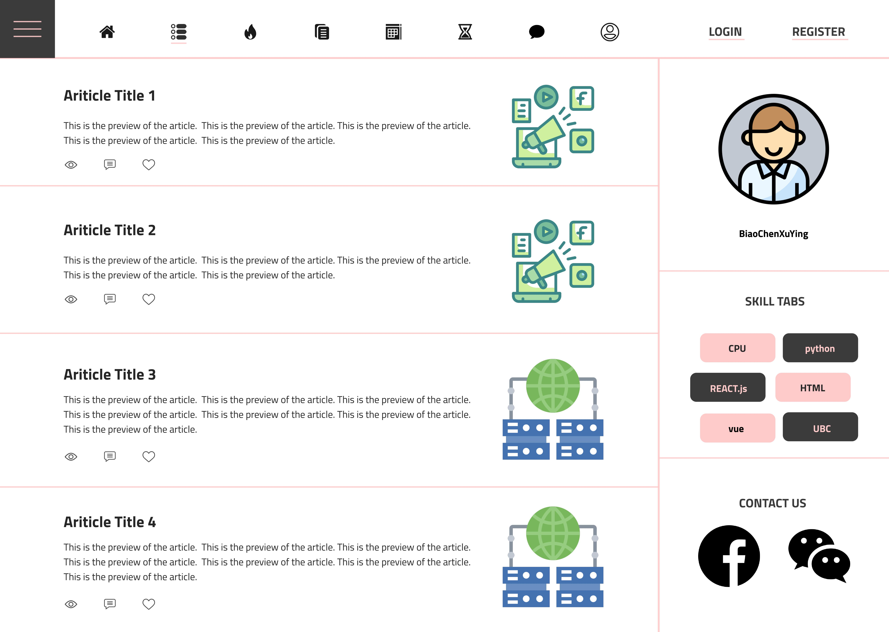
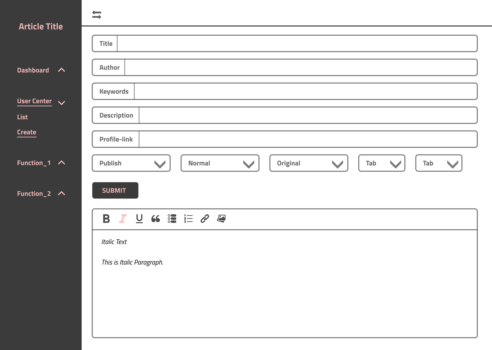
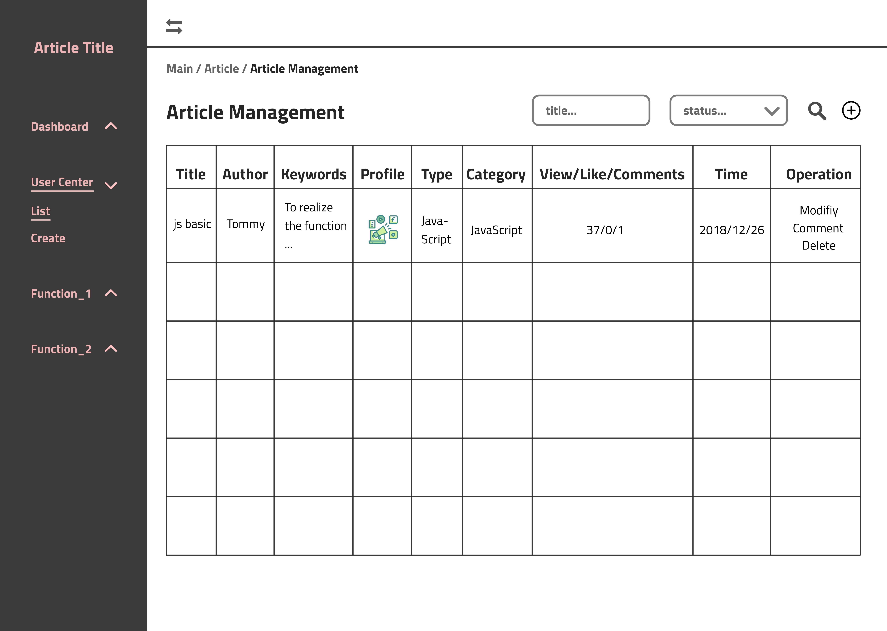

# Bloggy

- [Prototypes](https://github.com/chuntonggao/bloggy#prototypes)
- [Overview](https://github.com/chuntonggao/bloggy#overview)
- [Requirements](https://github.com/chuntonggao/bloggy#requirements)
- [Requirement breakdown](https://github.com/chuntonggao/bloggy#requirement-breakdown)
- [Tech stack](https://github.com/chuntonggao/bloggy#tech-stack)

This repo mainly provides an overview for the Bloggy project. If you are looking for source code, please refer to the following links:

- [Back-end repo](https://github.com/chuntonggao/bloggy-server.git) 
- [Front-end repo for publisher view] (https://github.com/chuntonggao/bloggy-publisher.git)
- Front-end repo for reader view (not started yet)

## Prototypes

### Reader view

### Publisher view

## Overview

- Who is Bloggy for?

> People who want to publish and edit their blogs online and people who want to read these blogs

- What will Bloggy do?

> Bloggy allows readers to read blogs online and post comments. Bloggy also allows publishers to publish and edit blogs online.

- What type of data will Bloggy store?

> Bloggy will mainly store data about users, articles and comments.

- What will users be able to do with this data?

> Publishers can publish articles, edit articles and respond to comments. Users can view articles and post comments.

- Additional / optional features

> We may allows tags for articles. Publishers can assign tags to articles. Readers can filter articles by tags. We may also allow publishers to showcase their projects in a separate page.

## Requirements

### Minimal requirements

- [ ] Publisher
	- [ ] Can register and log in 	
	- [ ] Can create and edit articles in a markdown rich text editor
	- [ ] Can switch between source code mode and preview mode in the editor
	- [ ] Can delete and respond to comments 

- [ ] Reader
	- [ ] Can register and log in
	- [ ] Can read articles
	- [ ] Can like articles
	- [ ] Can post comments to articles

### Standard requirements

- [ ] Publisher
	- [ ] Can post and edit projects
	- [ ] Can save unpublished articles as drafts

- [ ] Reader
	- [ ] Can view projects

###  Stretch requirements

- [ ] Publisher
	- [ ] Can assign tags to articles
	- [ ] Can create and about page and edit it

- [ ]  Reader
	- [ ] Can filter articles by tags
	- [ ] Can filter articles by year  
	- [ ] Can view the about page

A note on publishers and readers: we distinguish publishers from readers mainly because the publisher UI will look very different from the reader UI and they have different functionalities. However, every user is both a publisher and a reader, i.e. you can use the same credentials to view other people's blogs and publish your own blogs.

## Requirement breakdown

- [ ] Register / login
	- [ ] The front end should have a registration page and a login page
	- [ ] The front end should direct the user to a new page upon successful registration / login
	- [ ] The front end should save token to browser cookie
	- [ ] The front end should display proper error messages
	- [ ] The front end should have unit tests for the registration page and the login page
	- [ ] The back end should provide an enpoint for registration and an endpoint for login
	- [ ] The back end should return 400 and proper error messagesif password, name or email is missing or wrong
	- [ ] The back end should sign and send token if registration / login is successful
	- [ ] The back end should save the created user to the database if registration is successful
	- [ ] The back end should have unit tests for the registration endpoint and the login endpoint

- [ ] Article (publisher view)
	- [ ] The front end should have a markdown editor to support article editing
	- [ ] The front end should allow markdown preview
	- [ ] The front end should have a button to save changes
	- [ ] The front end should allow publishers to delete articles
	- [ ] The front end should have unit tests for these functionalities
	- [ ] The back end should have endpoints for article CRUD (creation, read, update and deletion)
	- [ ]  The back end should perform CRUD operations to articles in the database
	- [ ]  The back end should return 401 if someone attempts to CUD (create, update and delete) articles without loggin in
	- [ ]  The back end should allow anyone to read articles
	- [ ]  The back end should have unit tests for these article endpoints 

## Tech stack

- Front end (for both publisher view and reader view)
	- Language: ES6+ JavaScript + TypeScript (aims for 100% TS coverage if time permits, but may end up with a mixture of JS and TS)
	- Framework: react
	- UI library & design language: Ant Design
	- State management: redux
  - Client-side routing: react-router
  - Network requests: axios
  - Bundler: webpack
  - Transpiler: babel
  - Linting tools: ESLint + Prettier + husky + lintstaged
  - Markdown edit & preview: marked + highlight.js
  - Testing: Jest + Enzyme
  - Authentication & Authorization:  JWT (JSON Web Token) + browser cookie

- Back end
	- Language: node.js with TypeScript (JS not allowed, we want to make our server as stable as possible with a statically typed language)
	- Framework: express.js
	- Database: MongoDB + mongoose.js
	- Linting tools: ESLint + Prettier + husky + lintstaged
	- Transpiler: babel
	- Testing: mocha + chai
	- Authentication & authorization: JWT (JSON Web Token)
